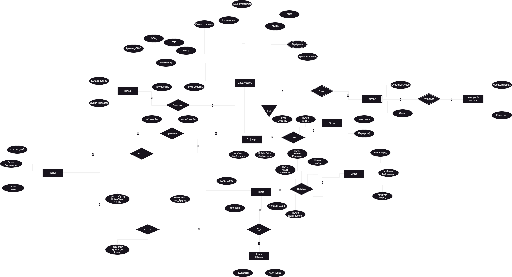
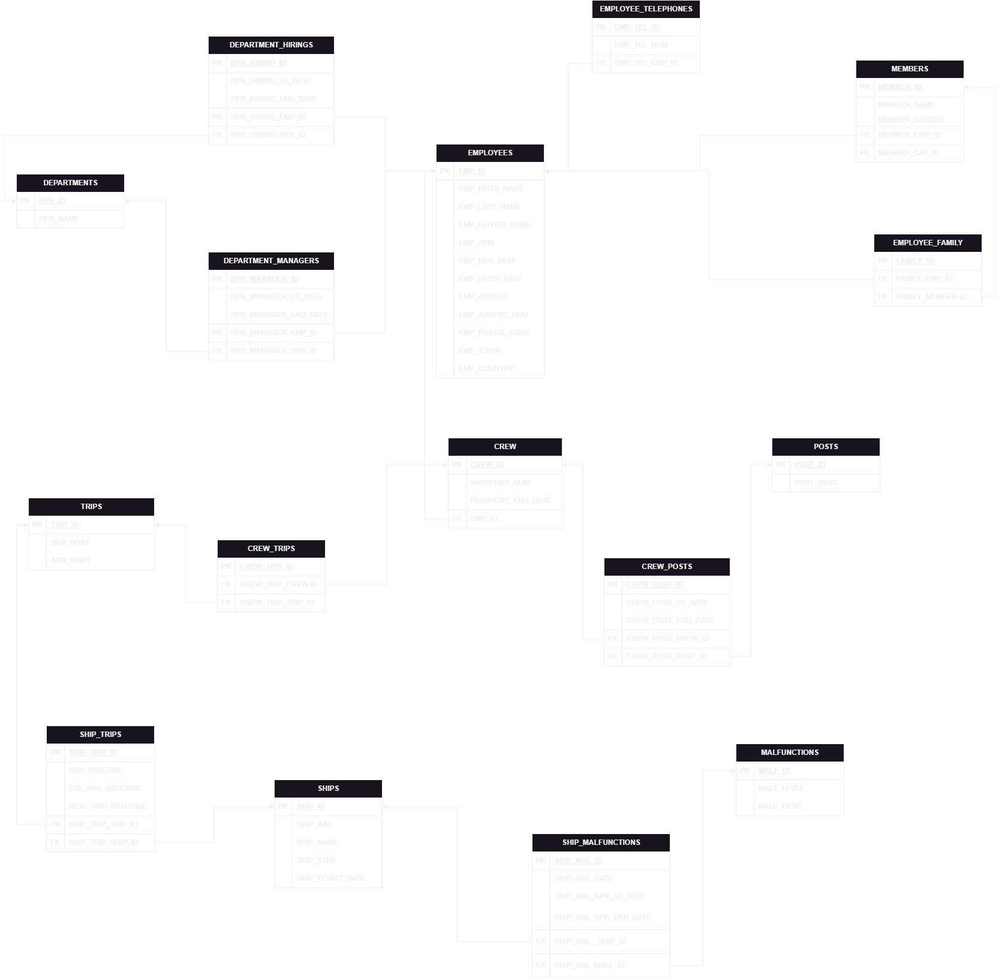

# C@rgoNautica - Shipping Company Database System

**University Project** – IVT AKMI | Database Design & Implementation

## 📌 Project Overview

**C@rgoNautica** is a comprehensive database system developed as part of a semester project for the "Database Organization Systems" course at IVT AKMI. The system is designed to meet the operational and data management needs of a modern shipping company, including crew management, vessel tracking, and trip monitoring.

The main goal of this project was to analyze, design, and implement a fully relational database that supports the key business processes of a shipping enterprise using realistic data structures and scenarios.

---

## 🧱 Entity-Relationship Diagram (ERD)

The ERD below provides a conceptual overview of the system, outlining the main entities and their relationships:

---

## 🗃️ Relational Schema (Database Tables)

The following diagram shows the final relational model derived from the ERD. It includes primary keys (PK), foreign keys (FK), and table structures that define the logical database schema:

---

## 📂 Project Structure

The project is organized as follows:

- `Database/Schema.sql` – SQL script to create the database schema (tables, constraints, relationships).
- `Database/MockData/` – Separate `.sql` files for inserting dummy data into each table.
- `Database/Queries.sql` – Collection of SQL queries used for testing and retrieving meaningful insights from the database.

---

## 🧪 Testing & Validation

- All queries were tested on MySql using MySql Workbench.
- Referential integrity and constraints were validated.
- Dummy data simulate real-world scenarios.

---

## 👨‍💻 Technologies Used

- MySQL
- MySQL Workbench
- Draw.io (ERD)

---

## 📚 Author

**Georgios Koutourinis**  
IVT AKMI – Semester B6  
Department: Software Engineer  
Academic Year: 2024–2025

---

## 📎 License

This project is for academic purposes only and not intended for commercial use.

